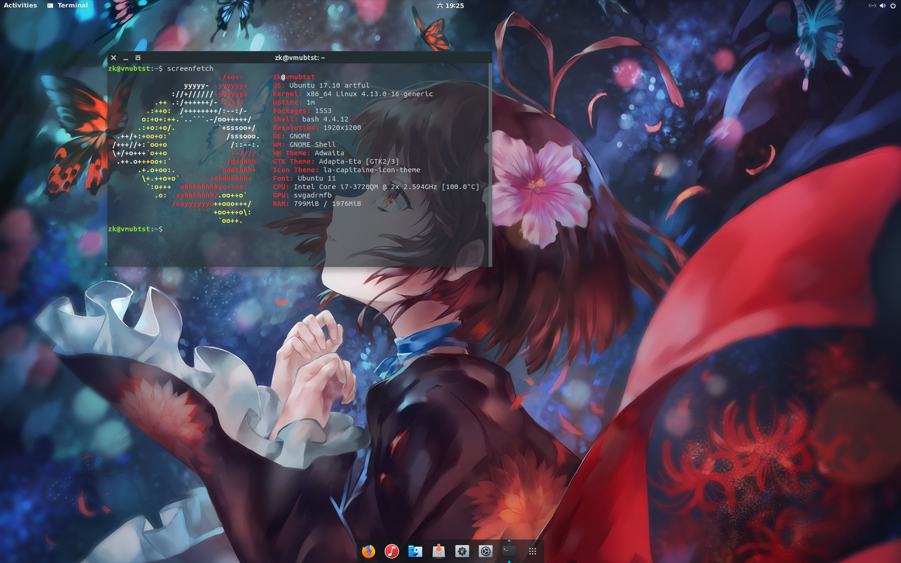
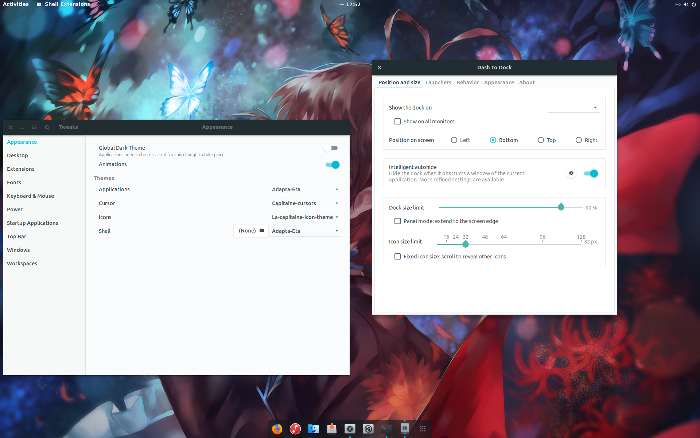

# ubuntu桌面美化

## 序言

正如上篇文章（还没写出来）里所说，今年夏天我终于敲定了自己的生产环境 Mac+ubuntu@fusion+win@PD，mac作为主力生产环境，ubuntu作为运行和测试环境。但ubuntu默认界面有点丑了，所以做了简单的美化，美化的主体思路基本都是按B站[卟嚟卟嚟](https://space.bilibili.com/3030024?spm_id_from=333.338.viewbox_report.7#/)这位up主[【Linux】GNOME的简单美化视频](https://www.bilibili.com/video/av10634328/) ,效果如图



一个美到窒息的工作环境真的是生产力源泉，每次上课的时候心思都会飞去虚拟机里写代码。

## Prerequisites

- 系统 最好是ubuntu17.10+
ubuntu在最新的17.10中终于抛弃了丑陋的unity，换用了gnome。本次美化使用的主题和扩展都是基于gnome和gnome shell的，所以配合ubuntu17.10食用风味最佳。ubuntu16.04 亲测主题可用，扩展无法使用并效果会打折扣
- git
- vim/nano

## 具体步骤

接下来是整个系统美化的具体步骤，即 管理工具-主题-图标-光标-扩展-配置
每个工具的安装方法其项目主页都有详细的说明，此处仅作简述（当然如果你运气好的话仅依赖本文也是能够完成美化的=.=）

### 外观管理工具

- gnome-tweak-tool是一个提供对gnome3深度客制化的工具
首先安装gnome-tweak-tool来对我们后续的主题图标光标进行管理
- 安装
sudo apt-get install gnome-tweak-tool
如果是unity环境的话 可以使用unity-tweak-tool达到相仿的功能

### 主题 adapta-gtk-theme

- adapta是一款基于Material Design设计风格的主题，共有四款，后缀为-Nokto为暗系主题，后缀为-Eta是对标题栏做了缩窄以节省空间（个人偏爱）

- 安装

    - PPA安装 添加ppa源->更新->apt-get安装
    ```
    sudo add-apt-repository ppa:tista/adapta
    sudo apt-get update
    sudo apt-get install adapta-gtk-theme
    ```

    - 源码编译 具体步骤见github项目文档
    ```
    ./autogen.sh
    make
    sudo make install
    ```

### 图标 la-capitanie

- la-capitaine-icon-theme的设计风格混合了macOS和Material Design。由一位加拿大的大一小弟弟Keefer Rourke（看了一眼人家的网站和resume 人生无望）设计并完成。

- 安装

```
mkdir .icons
cd ~/.icons
git clone https://github.com/keeferrourke/la-capitaine-icon-theme.git
```

### 光标 capitaine-cursors

- capitaine-cursors同样是来自这个小弟弟的作品，用了之后仿佛mac-ubuntu完全无界
- 安装

```
git clone https://github.com/keeferrourke/capitaine-cursors.git
cd capitaine-cursors
cp -pr dist/ ~/.icons/capitaine-cursors
```

### gnome-shell-extensions

- 上面图片中底部类似mac dock栏的实现就是依赖于一个dash to dock的扩展，除此之外还有 dash to panel,user themes 等很多有意思的扩展。但如何安装扩展wiki感觉有点模糊，又花了一段时间才找到了正解2333
- 安装（三步均需按顺序完成）
1. Firefox/chrome打开gnome extensions网站，浏览器会提示你添加gnome-shell的扩展，按提示添加扩展即可。
2. 而后无论是Firefox还是chrome 在终端里执行 sudo apt-get install chrome-gnome-shell
3. 之后在gnome extensions中选择/搜索你希望添加的扩展，点进去讲off的划钮点成on，就会自动提示安装这个扩展了。此处需安装dash to dock、user theme两个扩展

### 最后的配置

打开gnome-tweak-tool在
gnome-tweak-tool

- Appearance-Themes-Applications-选择为Adapta-*
- Appearance-Themes-Cursor-选择为capitaine-cursors
- Appearance-Themes-Icons-选择为la-capitaine-icon-theme
- Appearance-Themes-Shell-选择为Adapta-* （此项需添加user theme扩展后才能设置）
- Windows-Placement-选择为Left（同macOS工作环境统一）
- Windows-Double-click-选择为Minimize（同macOS工作环境统一）
- Extensions-dash to dock-保证其开启 （此时桌面左侧原生dash被dock取代），点击设置按钮，按个人喜好调整（Botton、icon size32、Opacity60%）



## BINGO！ 大功告成

Ending
